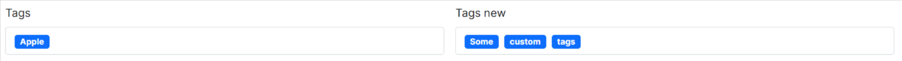

# Tags for Bootstrap 4/5

[](https://nodei.co/npm/bootstrap5-tags/)
[](https://www.npmjs.com/package/bootstrap5-tags)

## How to use

An ES6 native replacement for `select` using standards Bootstrap 5 (and 4) styles.

No additional CSS needed! Supports creation of new tags.

```js
import Tags from "./tags.js";
Tags.init();
// Tags.init(selector, opts);
// You can pass global settings in opts that will apply
// to all Tags instances
```

By default, only provided options are available. Validation error
will be displayed in case of invalid tag.

```html
<label for="tags-input" class="form-label">Tags</label>
<select class="form-select" id="tags-input" name="tags[]" multiple>
  <option disabled hidden value="">Choose a tag...</option>
  <option value="1" selected="selected">Apple</option>
  <option value="2">Banana</option>
  <option value="3">Orange</option>
</select>
<div class="invalid-feedback">Please select a valid tag.</div>
```

## Creation of new tags

Use attribute `data-allow-new` to allow creation of new tags. Their
default value will be equal to the text. Since you can enter
arbitrary text, no validation will occur.

```html
<select class="form-select" id="tags-input" name="tags[]" multiple data-allow-new="true"></select>
```

You can force these new tags to respect a given regex.

_NOTE: don't forget the [] if you need multiple values!_

## Server side support

You can also use options provided by the server. This script expects a json response that is an array or an object with the data key containing an array.

Simply set `data-server` where your endpoint is located. It should provide an array of value/label objects. The suggestions will be populated upon init
except if `data-live-server` is set, in which case, it will be populated on type. A ?query= parameter is passed along with the current value of the searchInput.

You can preselect values either by using `data-selected` or by marking the suggestion as `selected` in the json result.

```html
<label for="validationTagsJson" class="form-label">Tags (server side)</label>
<select
  class="form-select"
  id="validationTagsJson"
  name="tags_json[]"
  multiple
  data-allow-new="true"
  data-server="demo.json"
  data-live-server="1"
>
  <option disabled hidden value="">Choose a tag...</option>
</select>
```

## Options

Options can be either passed to the constructor (eg: optionName) or in data-option-name format.

| Name                 | Default        | Description                                                                                     |
| -------------------- | -------------- | ----------------------------------------------------------------------------------------------- |
| allowNew             | false          | Allow typing arbitrary new tags                                                                 |
| showAllSuggestions   | false          | Show all suggestions even if they don't match                                                   |
| badgeStyle           | primary        | Color of the badge (color can be configured per option as well)                                 |
| allowClear           | false          | Show a clear icon                                                                               |
| server               | ''             | Point to a given endpoint that should provide the list of suggestions                           |
| liveServer           | false          | Should the endpoint be called dynamically when typing                                           |
| serverParams         | {}             | Additionnal params to pass alongside the query parameter                                        |
| selected             | ''             | A comma separated list of selected values                                                       |
| suggestionsThreshold | 1              | How many chars are needed before showing suggestions (0 to open immediately)                    |
| validationRegex      | false          | Regex for new tags                                                                              |
| separator            | ''             | A list (pipe separated) of characters that should act as separator (default is using enter key) |
| max                  | false          | Limit to a maximum of tags                                                                      |
| placeholder          | ''             | Provides a placeholder if none are provided as the first empty option                           |
| clearLabel           | 'Clear'        | Text as clear tooltip                                                                           |
| searchLabel          | 'Type a value' | Default placeholder                                                                             |
| valueField           | 'value'        | Value field                                                                                     |
| labelField           | 'label'        | Label field                                                                                     |
| keepOpen             | false          | Keep suggestions open after selection, clear on focus out                                       |
| fullWidth            | false          | Use full input width from the dropdown menu                                                     |
| debounceTime         | 300            | Debounce live server calls                                                                      |

## Tips

- You can also use it on single selects! :-)
- Use arrow down to show dropdown (and arrow up to hide it)
- If you have a really long list of options, a scrollbar will be used
- Access Tags instance on a given element with Tags.getInstance(mySelect)

## Without Bootstrap 5

### Bootstrap 4 support

Even if it was not the initial idea to support Bootstrap 4, this component is now compatible with Bootstrap 4 because it only
requires minimal changes.

Check out demo-bs4.html

### Standalone usage

Obviously, this package works great with the full bootstrap library, but you can also use it without Bootstrap or with a trimmed down version of it

Actually, this library doesn't even use the js library to position the dropdown menu, so its only dependencies is only on css classes.
You can check out the .scss file to see how to reduce bootstrap 5 css to a smaller size.

Check out demo-standalone.html

## Demo

https://codepen.io/lekoalabe/pen/ExWYEqx

## How does it look ?



## Browser supports

Modern browsers (edge, chrome, firefox, safari... not IE11). [Add a warning if necessary](https://github.com/lekoala/nomodule-browser-warning.js/).

## I need more

Maybe you can have a look at https://github.com/Honatas/multi-select-webcomponent
